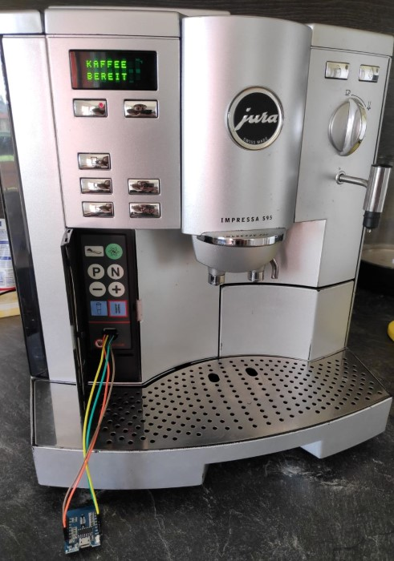

# jura-smartify &#9749;
An easy to use ESP8266 web application to control your Jura-S95 via WiFi.

## Introduction
Once upon some time ago.. I was cleaning my Jura Impressa S95 while I was noticing that liddle lid behind the cover of the programming keys labeled "Service" which I was never investigating before. A few seconds later the lid was removed and a serial interface came to light which aroused my curiosity about potential usage possibilities.

A bit of google research unveiled several repos (e.g. [jura-coffee-machine](https://github.com/hn/jura-coffee-machine), [Coffeemaker-Payment-System](https://github.com/oliverk71/Coffeemaker-Payment-System) or [CoffeeMaker](https://github.com/thomaswitt/CoffeeMaker)) that had same thoughts about that serial interface and managed to communicate with the Jura coffee machine.

Each of them seemed to not fit my daily needs or missed some functionality, so I created my own application, merged code of the named repos (thanks for reverse engineering!) and added the stuff I was looking for.

## Features
- Fully functional web interface, enhanced for mobile phones.
- Easily operable via predefined buttons.
- Optionally custom commands can be sent to machine.
- Status decoding and automated refresh on opening interface.
- Blue status LED on ESP8266 lights up while receiving and processing commands.
- Connects to your local WiFi.
- No USB power supply needed. The Jura S95 has a permanent 5V supply on Pin 1.

## How to use
This project was set-up with [PlatformIO](https://platformio.org/) using the Arduino framework for the ESP8266 (Wemos D1 mini in my case).

### Preparing ESP8266
Check out the code, set your WiFi credentials via `WIFISSID` and `WIFIPASSWORD` variables and flash it to your microcontroller.
Your new smart Jura coffee machine will show up in your WiFi network as "Jura-S95". Just look for its IP address in your router.

### Wiring
The serial service interface has got four pins. From left to right, wire it to your ESP8266 as follows:  
1 - VCC (5V)  
2 - D7 (GPIO 13) 
3 - GND  
3 - D6 (GPIO 12)

